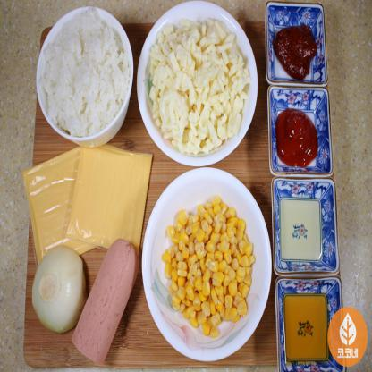

# AI Services for Culinergy

### Setup
Installation dependencies
```
pip install -r requirements.txt
```
Start flask server
```
python app.py
```

### API Docs
Server Usage:

1. Ingredient Detection:

   - Method: POST
   - URL: http://127.0.0.1:5000/detect/
   - Example input: `base64` encoding of this image in key-value format.

      

     ```json
     { "image": "/9j/4...5//Z" }
     ```

   - Example output: `box` is in `xywh` format.

     ```json
      [
         {
            "ingredient_id": 1789,
            "box": [
                  220.81784057617188,
                  99.18624877929688,
                  110.39013671875,
                  151.47592163085938
            ]
         },
         {
            "ingredient_id": 1789,
            "box": [
                  100.06812286376953,
                  222.4312744140625,
                  132.0072479248047,
                  105.67347717285156
            ]
         },
         {
            "ingredient_id": 2478,
            "box": [
                  231.61294555664062,
                  299.3686218261719,
                  98.85093688964844,
                  136.8990936279297
            ]
         }
      ]
     ```

1. Food Recommendation:

   - Method: POST
   - URL: http://127.0.0.1:5000/recommend/
   - Example input: 1789 (Cheese), 2478 (Corn)
     ```json
     { "ingredient_ids": [1789, 2478] }
     ```
   - Example output: 

     ```json
     {"food_ids": [8756, 9718, 2728, ... , 1189, 1418]}
     ```
